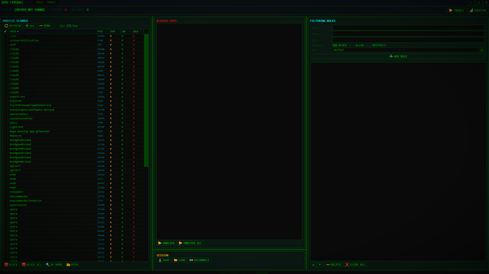

# KernelFirewall



Windows kernel-mode firewall built on WFP (Windows Filtering Platform) with ETW-based traffic monitoring and a WPF GUI for real-time management.

## Overview

KernelFirewall consists of two components:

- **Kernel driver** (`KernelFirewall.sys`) — WFP callout driver that intercepts network traffic at multiple layers of the network stack and applies filtering rules
- **WireFirewall** (`WireFirewall.exe`) — WPF GUI application for creating rules, blocking applications, monitoring traffic and inspecting packets

## Features

### Filtering
- Process-based filtering by executable path or PID
- IPv4 and IPv6 with subnet masks and prefix length
- Port ranges (TCP/UDP)
- Traffic direction: inbound, outbound or both
- Three rule actions: Block, Allow, Allow with restrictions
- Priority-based rule evaluation (first match wins)
- Application blacklist independent of rules

### Traffic Monitor
- Real-time packet capture with ETW
- Per-process statistics: packets sent, received, blocked
- Packet inspection with OSI layer breakdown (L2–L7)
- Raw hex dump viewer
- Filtering by protocol, status, text search

### Interface
- Terminal-style dark theme with CRT scanline overlay
- Custom title bars, green-on-black color scheme
- Session save/load for rule sets
- Status bar with live counters (blocked/allowed packets)
- Process scanner with bulk actions

## Requirements

- Windows 10 x64 or later
- Visual Studio 2022 with WDK (Windows Driver Kit)
- .NET Framework 4.8 (for GUI)
- Test signing enabled for development

## Build

Open `KernelSecurity.sln` in Visual Studio and build the solution. Driver compiles as x64 only.

## Installation

**Enable test signing** (one time, requires reboot):
```
bcdedit /set testsigning on
```

**Install driver** (run as Administrator):
```
install_driver.bat
```

The script copies `.sys` to `%SystemRoot%\System32\drivers\`, registers the service and starts it.

**Launch GUI:**
```
WireFirewall.exe
```

## Uninstall

```
uninstall_driver.bat
```

Stops the service, removes the registration and deletes the driver file from `System32\drivers`.

## Limits

| Parameter | Maximum |
|---|---|
| Rules | 256 |
| Blocked apps | 512 |
| IP addresses per rule | 64 |
| Port ranges per rule | 32 |
| Process statistics entries | 256 |

## License

Private project. All rights reserved.
